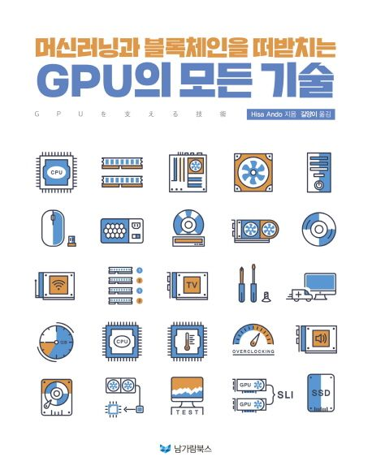

  
<h1 align="center">
  
GPU의 모든 기술

  
</h1>
  
  
<b>Hisa Ando 저 · 길양이 역</b> 
남가람북스 · 2018년 04월 14일 출시</b> 

## :bulb: 목표

- **SIMPLE: GPU 구조를 공부한다.**

  > GPU가 어떤 구조를 가지고 어떻게 작동하는지를 공부한다.

 

## 🚩 정리한 문서 목록

### 📔 GPU 처리 원리

 - [CPU와 GPU 기초](https://github.com/erectbranch/GPU_Basic/tree/master/ch01)

   > CRT, LCD, GPU가 display하는 원리(full buffer/tiling), DAC, 3D 그래픽, transpose, CPU와 GPU 성능 비교, heterogeneous system, SoC, SIMD와 SIMT

 - [GPU와 계산 처리 변쳔](https://github.com/erectbranch/GPU_Basic/tree/master/ch02)

   > vertex shader, pixel shader, unified shader, Tesla GPU, Streaming Multiprocessor, CUDA

   > 병렬 처리 패러다임: MIMD, SIMD, SIMT

 

## :mag: 목차

### Chapter 1 [입문] 프로세서와 GPU

1.1 컴퓨터 시스템과 이미지 표시의 기초

프레임 버퍼, VRAM, 디스플레이 인터페이스

    __ 컴퓨터로 이미지를 표시하는 원리
    __ 이미지를 표시하는 디스플레이　브라운관과 래스터 주사
    __ 액정 디스플레이 - 액정 셀, 픽셀, dpi
    __ 프레임 버퍼와 디스플레이 인터페이스

1.2 3D 그래픽의 역사

문자에서 그림, 2D, 3D로. 고품질과 실시간

    __ 초기 그래픽
    __ 컴퓨터 그래픽 이용 확대 - 고품질 이미지, 실시간 그리기
    __ 3차원 물체의 모델링과 표시

1.3 3D 모델 만들기

패널, 좌표, 배치, 빛

    __ 종이 등 모델링 만들기 - 패널, 지역 좌표와 전역 좌표
    __ 행렬을 적용하여 위치나 방향을 바꾸어 배치 - 모델링 변환, 시점 변환, 모델링 뷰 변환, 트랜스포즈
    __ 빛의 반사 계산 - 라이팅

1.4 CPU와 GPU의 차이

프로세서도 적재적소에

    __ GPU는 병렬 처리로 높은 성능을 실현 - 수십~수천 개의 연산기, GDDR DRAM
    __ GPU의 출현
    __ GPU 컴퓨팅의 출현 - 부동소수점 연산으로 넓어진 활약 장소
    __ GPU는 대량 병렬 프로세서 - 데스크톱 PC를 위한 CPU와 게임을 위한 GPU 비교
    __ GPU는 병렬 처리에서 높은 성능 발휘
    __ CPU와 GPU의 이종 시스템과 그에 따른 문제

1.5 사용자 가까이에 있는 다양한 GPU

SoC, CPU 칩 내장, Discrete GPU

    __ 휴대전화용 GPU - 스마트폰이나 태블릿용 SoC 탑재
    __ CPU 칩에 내장된 GPU - Intel Core 시리즈, AMD APU
    __ Discrete GPU와 그래픽 워크스테이션 - 소비전력 200W를 넘는 범위에서 최고의 성능을 원하는 사용자

1.6 GPU와 주된 처리 방식

메모리 공간, 그릴 때의 GPU 메모리 확보 방식, 병렬 처리

    __ 공통 메모리 공간인가 별도 메모리 공간인가?
    __ 풀 버퍼 방식인가, 타일링 방식인가? - 그릴 때의 GPU 메모리 확보 방식
    __ SIMD 방식인가, SIMT 방식인가? - 좌표와 픽셀 색 4요소를 하나로 묶어 다루기

1.7 정리

### Chapter 2 GPU와 계산 처리의 변천

2.1 그래픽과 가속기의 역사

게임기, PC 그래픽

    __그래픽 처리 하드웨어의 역사 - 게임, 하이엔드 시뮬레이터, 과학 기술 계산
    __ 아케이드 게임기
    __ 가정용 게임기
    __ 그래픽

2.2 그래픽 보드 기술

2D 배경+스프라이트, BitBLT, 2D/2.5D/3D 그래픽 가속기

    __ 2D 배경+스프라이트
    __ BitBLT
    __ 2D 그래픽 가속기
    __ 3D 그래픽 가속기

2.3 과학 기술 계산에 GPU 응용

유니파이드 셰이더, 배정도 부동소수점 연산, 프로그래밍 환경

    __ 유니파이드 셰이더
    __ GPU를 이용한 과학 기술 계산 - G80 아키텍처
    __ 과학 기술 계산은 32비트로는 정밀도 부족 - GT200 아키텍처, GF100 Fermi GPU
    __ CUDA 프로그래밍 환경
    __ 오류 검출과 수정

2.4 병렬 처리 패러다임

기본, MIMD/SIMD/SIMT의 차이

    __ GPU 좌표 변환 계산을 병렬화함 - 병렬 계산을 위한 기초 지식
    __ MIMD형 프로세서
    __ SIMD형 프로세서
    __ SIMD 실행 문제
    __ SIMT 실행

2.5 정리

### Chapter 3 [기초 지식] GPU와 계산 처리

3.1 3D 그래픽의 기본

OpenGL의 렌더링 파이프라인을 예로 들어

    __ [기초 지식] OpenGL의 렌더링 파이프라인
    __ 프래그먼트 셰이더 - 프래그먼트의 색과 깊이 방향의 위치를 계산
    __ 샘플마다 연산 - 렌더링 파이프라인의 마지막

3.2 그래픽 처리를 수행하는 하드웨어의 구조

Intel HD Graphics Gen 9 GPU의 예

    __ Intel HD Graphics Gen 9 GPU 코어 - 강력한 GPU를 탑재한 PC용 프로세서

3.3 [스피드 학습] 게임 그래픽과 GPU

하드웨어와 소프트웨어, 그 진화의 궤적 - 특별 기고: 니시카와 젠지(西川 善司)

    __ [하드웨어 분야의 진화] 첨단 3D 게임 그래픽은 아케이드부터 - 고유의 시스템, 고유의 3D 그래픽
    __ PlayStation과 세가 새턴이 불러온 3D 게임 그래픽 데모크라시 - PC 3D 그래픽의 여명기
    __ DirectX 7 시대 - 진정한 의미의 ‘GPU’가 등장하기 시작
    __ 프로그래밍 가능 셰이더 시대의 개막 - Shader Model (SM) 사양
    __ [소프트웨어 분야의 진화] 근대 게임 그래픽의 ‘3개의 신기’ - 표현 요소로 보는 근대 게임 그래픽
    __ [빛 표현] 법선 매핑 - HD 게임 그래픽 시대에 이르러 요구된 하이 디테일 표현
    __ [그림자 표현] 최신 GPU도 그림자 자동 생성 메커니즘은 탑재하지 않음
    __ [현재 주류인 그림자 표현] 깊이 그림자 기법 - 다양한 그림자를 만들 수 있게 됨
    __ HDR 렌더링 - 현실 세계의 휘도를 가능한 한 정확히 표현하려면
    __ HDR 렌더링이 가져온 3가지 효능

3.4 과학 기술 계산과 GPU

높은 연산 성능으로 용도가 확장됨

    __ 과학 기술 계산의 대상은 범위가 무척 넓음
    __ 과학 기술 계산과 부동소수점 연산 - 극단적으로 큰 수와 극단적으로 작은 수를 동시에 다루려면
    __ 부동소수점 연산의 정밀도 사용 구분 - 그래픽, 스마트폰, 과학 기술 계산

3.5 병렬 계산 처리

프로세서의 코어 수 증가와 계산/프로그램의 관계

    __ GPU의 데이터 병렬과 스레드 병렬
    __ 3D 그래픽의 병렬성 - 정점 좌표 변환, 픽셀 셰이딩
    __ 과학 기술 계산의 병렬 계산 - 병렬화를 어떻게 활용할 것인가?

3.6 GPU 관련 하드웨어

메모리 용량, 대역폭, CPU와의 연결, 오류와 대책

    __ 장치 메모리 관련 기초 지식
    __ CPU와 GPU의 연결
    __ 전자 회로의 오류 구조와 대책

3.7 정리

### Chapter 4

[상세] GPU의 대량 병렬 처리

4.1 GPU의 병렬 처리 방식

SIMD와 SIMT

    __ SIMD 방식 - 4개의 좌표 값을 묶어 하나의 데이터로 취급
    __ SIMT 방식 - 하나씩 계산

4.2 GPU 구조

NVIDIA Pascal GPU

    __ NVIDIA Pascal GPU 기초 지식
    __ NVIDIA GPU의 명령 실행 구조 - [하드웨어 관점] 프로그램의 구조와 실행
    __ 여러 개의 스레드 실행
    __ SM 실행 유닛
    __ GPU의 메모리 시스템 - 연산기에 직접 연결한 고속 최상위 기억 레지스터 파일부터
    __ 워프 스케줄러 - 연산 대기 시간을 숨김
    __ 프레디케이트 실행 - 조건 분기 실현

4.3 AMD와 ARM의 SIMT 방식 GPU

AMD GCN 아키텍처와 ARM Bifrost GPU

    __ AMD GCN 아키텍처 GPU
    __ 스마트폰용 SoC
    __ ARM Bifrost GPU

4.4 GPU 사용성을 개선한 최근의 기술

유니파이드 메모리, SSG, 세밀도 프리엠프션

    __ 유니파이드 메모리 주소
    __ NVIDIA Pascal GPU의 유니파이드 메모리
    __ AMD Polaris GPU의 SSG
    __ 세밀도 프리엠프션 - 명령이 끝날 때 처리를 바꿈

4.5 오류 검출과 수정

과학 기술 계산 용도에서는 필수인 기능

    __ 과학 기술 계산의 계산 결과와 오류
    __ 오류 검출과 수정의 기본 원리
    __ 패리티 체크
    __ ECC - 허밍 부호
    __ 강력한 오류 검출 능력이 있는 CRC
    __ 장치 메모리 ECC 문제

4.6 정리

### Chapter 5 GPU 프로그래밍의 기본

5.1 GPU 호환성의 사고방식

완전한 상위 호환은 어려운 상황

    __ 하드웨어 호환성, 기계어 명령 수준의 호환성
    __ NVIDIA의 추상화 어셈블러 PTX
    __ GPU 언어 수준의 호환성 - CUDA와 OpenCL

5.2 CUDA

NVIDIA의 GPU 프로그래밍 환경

    __ CUDA의 C 언어 확장
    __ CUDA 프로그램에서 사용하는 변수 - 벡터형 변수 지원
    __ 장치 메모리의 할당/해제와 호스트 메모리와의 데이터 전송
    __ [간단한 예] 행렬 합을 계산하는 CUDA 프로그램
    __ CUDA의 수학 라이브러리
    __ NVIDIA GPU의 계산 능력
    __ CUDA 프로그램의 실행 제어
    __ CUDA의 다이내믹 패러렐리즘
    __ CUDA의 유니파이드 메모리
    __ 여러 개의 GPU 시스템 제어

5.3 OpenCL

업계 표준 GPU 계산 언어

    __ OpenCL이란?
    __ OpenCL의 변수
    __ OpenCL의 실행 환경
    __ 커널 실행
    __ OpenCL의 메모리
    __ OpenCL 프로그램 예

5.4 GPU 프로그램 최적화

성능 이끌어내기

    __ NVIDIA GPU의 그리드 실행
    __ 메모리 액세스 효율화
    __ 더블 버퍼를 사용하여 통신과 계산을 겹침

5.5 OpenMP와 OpenACC

지시자를 이용한 GPU 프로그래밍

    __ OpenMP와 OpenACC의 기초 지식
    __ NVIDIA가 힘을 쏟는 OpenACC
    __ OpenMP를 사용한 병렬화
    __ OpenACC와 OpenMP4

5.6 정리

### Chapter 6 GPU 주변 기술

6.1 GPU의 장치 메모리

대량 데이터를 고속으로 공급

    __ DRAM

6.2 CPU와 GPU 사이의 데이터 전송

PCI Express 관련 기술, NVLink, CAPI

    __ PCI Express
    __ NVIDIA의 NVLink
    __ IBM의 CAPI
    __ AMD의 SSD 탑재 GPU - 빅데이터 처리에 위력을 발휘할 가능성

6.3 정리

### Chapter 7 GPU 활용의 최전선

7.1 딥러닝과 GPU

신경망의 기본부터 활용 예까지

    __ 딥러닝에 사용되는 신경망
    __ 딥러닝에 필요한 계산과 GPU
    __ 커스텀 ASIC이나 FPGA를 이용한 딥러닝 - 강력한 경쟁자
    __ 딥러닝에서의 GPU 활용 사례

7.2 3D 그래픽과 GPU

다양한 3D 사례

    __ NVIDIA의 GRID

7.3 슈퍼컴퓨터와 GPU

높은 연산 성능을 추구

    __ 세계 상위 15위까지의 슈퍼컴퓨터 상황
    __ 츠쿠바대학의 HA-PACS/TCA 슈퍼컴퓨터
    __ 슈퍼컴퓨터는 어디에 사용하는가?

7.4 정리

### Chapter 8 프로세서와 GPU 기술 동향

8.1 CPU는 어떻게 될 것인가?

스마트폰 SoC용, 데이터센터용 CPU

    __ 스마트폰 SoC용 CPU
    __ 데이터센터용 CPU
    __ 고성능 CPU 기술 동향

8.2 GPU는 어떻게 될 것인가?

GPU의 종류와 미래

    __ GPU 종류
    __ 스마트폰 GPU는 어떻게 될 것인가?
    __ 하이엔드 GPU는 어떻게 될 것인가?
    __ Knights Landing - CPU와 가속기 일체화
    __ PEZY-SC - 일본발 매니 코어 CPU

8.3 소비전력 절감

아키텍처 혹은 회로 기술로 해결

    __ 아키텍처에 의한 전력 절약 설계 - 커스텀 로직, 동영상, 딥러닝
    __ 회로 기술에 의한 전력 절약

8.4 딥러닝 지원

AI에의 도전

_ 딥러닝 처리 엔진 - 16비트 반정도 부동소수점 연산과 8비트 고정소수점 연산 기능

8.5 정리