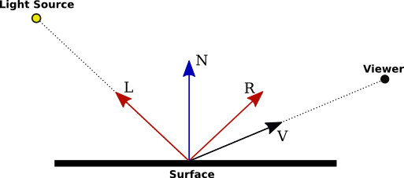

# 1 processor와 GPU

## 1.1 컴퓨터 시스템과 이미지 표시의 기초

컴퓨터는 program을 실행하면 memory의 **frame buffer**(프레임 버퍼)라는 화면 표시 영역에 임의의 data를 쓸 수 있다. 이때 화면 하나 분의 그림을 frame이라고 부른다.

> 동영상에서 frame을 30FPS(Frame Per Second)와 같이 표현하는 이유이다.

- frame buffer가 별도의 memory 안에 존재하는, 표시 전용 memory를 **VRAM**(Video RAM)이라고 부른다. 

복잡한 이미지라면 그 data를 생성하고 frame buffer에 저장하는 데 많은 계산과 memory access가 필요하다. 이에 그림을 그리거나 표시할 때 processor를 보조하는 전용 칩이 만들어졌다. 이를 Video chip(비디오 칩) 혹은 Graphics acceletor(그래픽 가속기)라 부른다.

---

### 1.1.1 CRT

CRT(Cathode Ray Tube. 브라운관)은 화면 전체를 표시하고자 전자 통로에 광선을 수평 방향과 수직 방향으로 휘도록 하는 자성 발생 코일을 놓는다. 

> TV의 경우 수평 방향으로는 매초 약 1만 6천번이라는 빠른 속도로 움직이며, 동시에 수직 방향으로는 매초 60번, 위에서 아래까지 커버하도록 위치가 움직인다.

이런 식으로 화면을 커버하는 방식을 Raster scan(래스터 주사)라고 부른다. 그리고 전자총에서 나온 전자 광선을 ON/OFF하는 기능을 갖추면 임의의 위치는 빛나게 하고, 그 외 위치는 어둡게 표시할 수 있다.

TV에서는 최초 1/60초는 홀수 번째의 수평선을 표시하고, 다음 1/60초는 짝수 번째의 수평선 부분을 표시하는 Interlace(인터레이스)라는 방법을 사용한다. 따라서 화면의 갱신은 초당 30번, 즉 30FPS가 된다.

> 참고로 반짝임이 드러나지 않고 동영상을 부드럽게 표시하려면 초당 60FPS가 필요하다.

컬러 화면을 표시하려면 RGB 형광물질을 빛나게 하는 3개의 전자 광선을 사용하면 된다. 

> 전자 광선이 한 점에 닿는 것은 한순간이지만, 형광물질의 발광이 어느 정도 시간 지속하면 눈의 잔상효과 때문에 반짝임이 없는 화면을 볼 수 있다.

전자 광선이 아래에서 위로 돌아가는 동안은 전자 광선을 OFF로 하는데, 이때 frame buffer의 내용을 다음 시점의 그림으로 바꿔두면서 화면을 표시할 수 있게 된다.

복잡한 그림을 그릴 때는 frame buffer 2개를 이용하여, 한쪽의 frame buffer 내용을 표시하는 동안 다른 쪽의 frame buffer 내용을 그리는 방식을 사용하기도 한다.

---

### 1.1.2 LCD

lcd는 row electrode와 column electrode로 구성되며, row와 column의 선택선이 ON된 교차점 부분에 있는 액정 셀을 통과한 빛의 양을 단시간 기억할 수 있게 만든 장치다.

액정은 CRT처럼 스스로 빛을 내지는 못하므로 Backlight(백라이트)라는 광원을 사용한다. (액정 셀은 이 상태를 1/30초 정도 유지할 수 있다.)

셀 하나하나가 picture를 구성하는 최저 단위라는 점에서 **Pixel**(픽셀)이라고 부른다. 액정 셀의 pitch(단자 사이의 거리)가 가늘고 많은 pixel이 있을수록 더 정밀하게 이미지를 표시할 수 있다.

> 이 액정의 정밀도를 나타내는 지표로 화면 전체 1M pixel 또는 4M pixel이라는 표현을 사용한다.

> 또는 1 inch에 몇 개의 pixel이 있는가를 표시하는 dpi(Dot Per Inch)라는 표현 방법도 사용한다. 예를 들면 96dpi, 300dpi와 같이 표현한다.

액정 각 셀에 액세스하는 일반적인 방법은 우선 상단의 row eletrode를 선택하고, 그 다음 column electrode를 왼쪽 제 1 column부터 오른쪽으로 차례대로 선택하며 교차점의 액정 셀에 빛의 투과량을 기록하여 기억하게 한다.

그리고 상단의 첫 번째 row column이 끝나면 두 번째 row column electrode를 선택하고 이 과정을 반복하는 것으로 화면 전체를 표시한다.

---

## 1.2 frame buffer와 display interface

앞서 첫 번째 위의 pixel 행에서 왼쪽에서 오른쪽으로 차례대로 셀에 표시 데이터를 기록했다. 이 과정이 끝나면 다음 pixel 행에서 이 과정을 진행하며 셀에 표시 데이터를 기록했다.

이런 방식 때문에 2행째 data는 1행째 data에 연결해서 저장하거나, 1행째 data 뒤에 빈 영역을 두고 data의 시작 address를 2의 거듭제곱이나 배수로 하는 것이 일반적이다.

display interface는 색과 밝기 정보가 담긴 여러 bit를 받는데, 따라서 digital signal을 analog signal로 변환하는 **DAC**(Digital to Analog Converter)가 필요하게 된다.

> 최근에는 대용량 memory를 frame buffer로 이용할 수 있게 되었으므로, RGBα에 각각 8bit를 할당하여 총 32bit로 1bit를 표시하는 방식이 일반적이다. α(투명도)는 표시 데이터로는 필요하지 않으므로 그림에서는 빠져 있다.

frame buffer에는 RGB 각각 8bit data가 1행 1열의 pixel부터 순서대로 나열된다. (1행 1열 (R, G, B)), 그리고 display controler는 display의 scan 타이밍에 맞춰서 frame buffer에서 1pixel씩 data를 읽어서 DAC를 통해 display로 보낸다.

결국 display interface가 하는 일은 display 쪽의 각 pixel scan 타이밍에 맞춰서, pixel에 대응하는 frame buffer의 data를 읽어와 공급하는 것뿐이다.

> 최근 GPU는 이 표시 기능, 그리기 기능에 더해 비디오 디코드 기능까지 내장하면서 display interface 전용 칩은 지나간 이야기가 됐다.

---

## 1.3 Three-Dimemsional model

LSI(Large-Scale Intergration)의 집적도 향상에 따라, '문자'만 표시할 수 있었던 display는 어느덧 가정용 게임기와 같은 일도 가능하게 되었다. LSI의 집적도나 성능이 더 개선되면서 **sprite**(스프라이트, 작은 패턴) 수도 늘어났다.

하지만 아직까지 2D만을 표현할 수 있었던 graphic은, 1999년경이 되자 3D graphic에 필요한 기능의 대부분을 한 칩에 넣을 수 있게 된다. 그렇다면 3D model은 어떻게 표현했을까? 우선 기본적인 3D object부터 보자.

> 3D graphics에서는 image를 기억하는 frame buffer뿐만 아니라, 다른 도형 뒤에 숨겨진 도형을 표시하지 않기 위한 Z buffer 등이 더 필요하다.

- **vertex**: 정점. 공간상에서의 position을 나타낸다. 아래 triangle strip에서는 3개의 vertex가 모여서 특정 object를 구성하는 요소가 된다.

- **polygon**: 폴리곤. vertex가 모여서 만들어진 face(면)이다. 예시에서는 3개의 vertex로 만들어진 삼각형을 의미한다.

- **edge**: 변. polygon에서 vertex와 vertex를 연결하는 직선(모서리)을 의미한다.

- **mesh**: 메시. polygon이 모여 구성된 Three-Dimenstional space상의 object이다.

아래는 바탕이 되는 표현 방식인 triangle strip이다.

3D의 curl(곡면)은 작은 panel로 분해해서 표현할 수 있다. 예를 들어 **triangle strip**(트라이앵글 스트립)은 연속한 삼각형으로 근사하여 구역을 나눈다. 또한 정상 부근은 **fan**(부채)과 같이 삼각형을 연결하여 근사한다.

> 사실 panel은 사각형 또는 그 이상의 다각형이라도 상관이 없으나 계산이 굉장히 복잡해지므로, 하나의 점만 추가해도 새로운 triangle이 생기는 triangle을 사용하는 것이다.

또한 여러 그림을 modeling한다면 독립된 좌표인 **model coordinate system**(모델좌표계, 지역좌표계)를 사용한 뒤ㅡ 이 후 모든 modeling 좌표를 묶은 **world coordinate system**(전역좌표계, 월드좌표계) 안에 배치하는 것이 편리하다.

> 합쳐진 model coordinate system은 world coordinate system에서 각각 offset을 가지며 존재하게 된다.

> 한 번 더 transform을 진행하면 world coordinate system을 우리의 눈 또는 카메라 좌표계에 해당하는 **view coordinate system**(시점좌표계)로 전환할 수 있다. 

---

### 1.3.1 matrix을 이용한 위치, 방향 전환

가령 좌표계에 있는 건물의 <U>배치</U>나 자동차의 <U>위치</U>를 바꿀 때는, model에 포함된 panel 모두의 vertex에 **translation transformation**(평행 이동) maxrix를 적용해야 한다. 

가령 model coordinate system에 translation을 적용했다고 하자.( $[x' y' z' 1]$ ) 새로운 position은 다음과 같다.

$$ \begin{bmatrix} x' \\ y' \\ z' \\ 1 \end{bmatrix} = \begin{bmatrix} 1 & 0 & 0 & dx \\ 0 & 1 & 0 & dy \\ 0 & 0 & 1 & dz \\ 0 & 0 & 0 & 1 \end{bmatrix} \begin{bmatrix} x \\ y \\ z \\ 1 \end{bmatrix} $$

- dx, dy, dz: 이동량

또는 자동차의 방향을 바꾸려면, 모든 vertex에 **rotation transformation**(회전) matrix를 적용해야 한다. 아래는 간단한 2차원 rotation 예시다.

> 이와 같이 만든 rotation은 origin을 기점으로 회전한다. 이 점에 유의할 것.

만약 z축을 중심으로 하는 rotation transformation을 만든다면 다음과 같다.

$$ \begin{bmatrix} x'' \\ y'' \\ z'' \\ 1 \end{bmatrix} = \begin{bmatrix} \cos\theta & \sin\theta & 0 & 0 \\ -\sin\theta & \cos\theta & 0 & 0 \\ 0 & 0 & 1 & 0 \\ 0 & 0 & 0 & 1 \end{bmatrix} \begin{bmatrix} x \\ y \\ z \\ 1 \end{bmatrix} $$

tranformation은 크게 두 가지로 나눌 수 있다.

> [모델변환과 시점변환](https://wjdgh283.tistory.com/entry/OpenGL%EB%A1%9C-%EB%B0%B0%EC%9A%B0%EB%8A%94-%EC%BB%B4%ED%93%A8%ED%84%B0-%EA%B7%B8%EB%9E%98%ED%94%BD%EC%8A%A4-Chapter-06-%EB%AA%A8%EB%8D%B8%EB%B3%80%ED%99%98%EA%B3%BC-%EC%8B%9C%EC%A0%90%EB%B3%80%ED%99%98)

- **modeling transform**: 모델 변환. world coordinate system에서 model 각각의 위치나 방향을 조정한다.

- **viewpoint transform**: 시점 변환. 어느 시점을 기준으로 변환한다.

이 둘은 의미적으로는 서로 다른 transformation이지만, 이 두 transformation을 합친 matrix를 만들어 두는 것으로 한번에 수행할 수 있게 된다.

---

## 1.3.2 빛의 반사 계산

물체가 보이는 원리는 광원(태양 등)에서 빛이 panel 표면에 반사되고, 그 빛이 우리의 눈으로 들어오기 때문이다. 이때 반사의 세기는 panel 면에 수직인 **normal vector**(법선 벡터)을 기준으로 입사각/반사각과 시점 위치에 따라 변한다. 

> 거울과 같이 매끄러운 표면의 물체는 입사각과 반사각이 균등한 방향으로 강하게 반사된다. 반면 종이와 같은 표면이면 반사각과는 크게 관계 없이 어느 방향으로도 빛이 반사된다.

모든 panel에서 표시 화면의 pixel마다 계산을 수행하는 처리를 **lighting**(라이팅)이라고 한다.

---

## 1.4 CPU와 GPU의 차이

GPU는 범용 처리를 수행하기 위한 processor로 여러 가지 처리를 가능한 한 짧은 시간 안에 실행할 수 있도록 만들어졌다. 한편, 3차원 표시 처리를 수행하는 GPU는 각각의 vertex 좌표 변환이나, pixel의 색이나 밝기 계산을 수행한다. 이 계산이 느려도 수많은 vertex나 pixel의 처리를 **parallelize**(병렬화)하면서 전체적인 실행 시간이 굉장히 단축되었다.

GPU는 간단하지만 굉장히 많은 processing unit을 가지고 있으므로, 모두 parallel로 동작시키면 CPU보다 1~2자리 수 높은 연산 성능을 얻을 수 있다. 

또한 연산을 위한 data 공급에는 **GDDR DRAM**(Graphics Double Data Rate DRAM)이라는, 일반적인 DDR(Double Data Rate) memory와 비교했을 때 1자리 수 높은 대역폭을 갖는 memory를 사용한다.(이렇게 더 큰 대역폭을 효과적으로 사용하기 위해서도 parallelize가 꼭 필요하다.)

초기 GPU의 등장에서 10년 가량은 graphics processing에 integer 연산을 사용했다. 하지만 이 방식은 나타낼 수 있는 수의 범위가 좁고, 값이 넘쳐버리는 문제가 있었다.

하지만 GPU 칩에 사용되는 transistor 수가 늘어나면서, 2008년부터는 GPU에 32bit single precision floating point 연산을 탑재하게 되었다. 이후 발전하여 64bit double precision floating point 연산까지 수행할 수 있는 GPU가 등장한다.

> 이런 발전 덕분에 parallel 정도가 높고, parallelize가 가능한 형태의 과학 계산 기술에서 GPU를 활용하게 되었다. 따라서 이런 용도로 사용하는 GPU를 GPGPU(General Purpose GPU)라고 부르기도 했다. 현재는 특별히 구분하지 않는 편이다.

이런 차이는 사양을 비교하면 확연하게 확인할 수 있다. 아래는 Intel Core i7-6700K CPU와 NVIDIA GPX 1080 GPU를 비교한 것이다.

| | CPU Intel Core i7-6700K | GPU NVIDIA GTX 1080 | 비고 |
| :---: | :---: | :---: | :---: |
| core 수 | 4 | 40 | GPU는 **SM**(Streaming Multiprocessor) 수를 나타낸다. |
| thread 수 | 8 | 2,560 | 동시 병렬 thread 수 |
| 연산기 수(FP64) | 4 $\times$ 8(32) |  40 $\times$ 2(80) | double precision |
| 연산기 수(FP32) | 4 $\times$ 16(64) |  40 $\times$ 64(2,560) | single precision |
| 연산기 수(FP16) | (지원하지 않음) |  40 $\times$ 64(2,560) | half precision |
| 피크 FP32 연산 성능 | 512GFlop/s | 8,228GFlop/s | 기본 clock일 때 |
| on-chip memory | 8MB | 2MB | **LLC**(Last Level Cache) Core i7은 L3 cache GTX 1080은 L2 cache이다. |
| off-chip memory 대역폭 | 34.1GB/s | 320GB/s | |
| clock frequency | 4 (4.2) GHz | 1.607 (1.733) GHz | |
| 소비전력 | 91W | 180W | |

> Flop/s는 '초당 floating point 연산 횟수'를 의미한다.

---

## 1.5 CPU와 GPU의 heterogeneous system

CPU와 GPU는 둘 다 processor이지만 서로 큰 차이가 있으므로, 일반적으로는 CPU와 GPU라는 서로 다른 형태의 processor를 접속한 **heterogeneous**(이종) system으로 사용한다.

> 다시 말해 각각 memory를 가지며, 따라서 GPU에 data를 전달하려면 CPU memory의 data를 복사해서 전달해야 한다.

- CPU에서는 OS를 실행하고 I/O나 network를 지원한다. 또한 data 입력을 수행하며 그 data를 GPU에 공급한다.

- GPU는 공급받은 data로 대량 계산을 수행하고 그 결과를 CPU에 돌려준다.

- CPU는 연산 결과를 disk 등의 I/O device에 기록하거나, network를 거쳐 외부로 보낸다.

> 이때 CPU와 GPU는 보통 $\times 16$ 의 **PCIe**(Peripheral Component Interconnect Express)로 연결한다. GPU 쪽에 **DMA**(Direct Memory Access) 엔진을 두고 CPU main memory와 GPU memory(device memory) 사이에서 memory block data의 복사가 이루어지게 된다.

CPU는 memory module 위에 여러 개의 DRAM 칩을 회로 기판 위에 탑재한 **DIMM**(Dual Inline Memory Module)으로 memory 용량을 늘릴 수 있다. 하지만 GPU는 device memory가 수 ~ 수십 GB로 고정이므로, 규모가 큰 data는 CPU의 memory에 두고 필요할 때만 GPU의 device memory로 옮겨 처리해야 하는 때도 있다.

---

### 1.5.1 heterogeneous system에 따른 문제

보통 3D modeling processing은 3D modeling data와 view point 정보, light source 정보 등을 CPU에서 GPU로 복사한다. 그리고 GPU의 그리기 kernel을 (GPU를 사용하는 program에 의해) 기동하면, frame buffer 안에 그림을 그릴 수 있다.(이후 display에 전송되며 표시된다.)

대체로 model data는 연속한 address에 저장되어 있으므로 CPU memory에서 GPU로 전송하는 과정은 쉽다. 하지만 그렇지 않은 상황도 존재한다. 대표적으로 아래와 같은 경우가 있다.

- deep copy

CPU memory에서 GPU memory로 복사할 data가 2차원 array일 경우, (C언어에서) row 방향 접근이면 연속한 address가 되겠지만, column 방향으로 접근한다면 그렇지 않을 것이다.

게다가 array의 element가 structure이고, 그 안에 pointer가 포함된 경우 같은 매우 어려운 상황도 존재할 수 있다. 

1. structure의 memory 공간을 할당받고 data를 복사한다.

2. pointer가 가리키는 값들이 저장된 memory 공간을, 별도로 GPU에 공간을 확보하여 복사한다.

3. GPU 쪽에서 pointer를 다시 addressing하여 pointer가 알맞게 address를 가리키도록 변경한다.

이렇게 pointer가 가리키는 data까지 복사해야 하는 경우를 **deep copy**라고 한다.

---

## 1.6 다양한 GPU 종류

이제는 현대 기기의 대부분에서 GPU가 필요하게 되었다. 하지만 기기마다 요건이 다르므로 다양한 GPU가 등장하게 된다.

1. SoC

스마트폰이나 태블릿 등에서는 CPU와 GPU, 그 밖의 각종 unit을 한데 모은 SoC(System on Chip)이 대표적이다. 발열로 인해 가능한 한 소비전력이 적은 설계를 채용하는 특징이 있다.(보통 수 W 정도)

그런데 3D modeling의 경우 frame buffer뿐만 아니라 Z buffer 등 다양한 unit이 필요했다. 1M pixel display만 해도 16MB 이상이 필요한 만큼, CPU와 GPU가 memory를 공유하는 Integrated GPU에서는 image 전체를 GPU memory에 저장하는 **full buffer** 형식으로 수행하기가 힘들다.

따라서 스마트폰 Soc와 같은 경우, display 영역을 tile로 나눠서 처리한다. 예를 들면 $(32 \times 32)$ pixel로 분할하여, 표시하는 triangle panel을 tile로 분류한다. 그리고 tile마다 순서대로 처리를 수행해 나가는 **tiling**(타일링) 처리 방법을 이용한다.

> 간단히 말하면 큰 image size = tile image size * n(tile 수)이다. 하지만 일부 겹치는 부분이 발생하므로, 계산량 자체는 늘어나게 된다. 작은 memory 접근으로도 큰 image를 처리할 수 있어서 사용한다.

 

2. Integrated GPU

CPU 칩에 GPU가 내장된 형태인 Integrated GPU(내장 GPU)도 많이 사용한다.(주로 노트북에서 많이 볼 수 있다.) 

> Intel Core 시리즈의 processor나 AMD의 APU(Accelerated Processing Unit)라 불리는 processor가 대표적이다.

대체로 노트북이나 데스크탑용으로 나오는 만큼 수 W에서 최대 100W 정도의 소비전력으로 만든다. 크기도 더 크고 발열도 냉각이 가능하다.

 

3. Discrete GPU와 그래픽 워크스테이션

디자인 툴이나 초고사양 게임을 구동하기 위해서는 극한의 그래픽 성능을 원하게 된다. 이런 사용자들을 위한 그래픽 워크스테이션도 만들어졌다.

이 경우는 CPU와 독립된 PCIe 카드 등에 탑재를 한 GPU를 사용한다. 내장 GPU와 차별화하는 의미로 **Discrete GPU**라고 부르기도 한다.

서로 다른 소비전력이 허용되며 따라서 아주 고성능의 GPU를 사용할 수 있다. 대체로 200W가 넘는 소비전력을 사용한다. 더 고성능이 필요하면 여기에 여러 대의 GPU를 사용하여 처리를 분산하기도 한다.

---

## 1.7 memory 공간 구조 종류

보통 multicore processor의 경우, 하나의 **shared main memory**를 쓰는 **SMP**(Symmetric Multi-Processing) 구조가 일반적이다. 그러나 CPU와 GPU는 각기 다른 종류의 process이며, 대역폭에도 큰 차이가 있으므로 각각 자신의 memory를 갖는 구조가 일반적이었다. 

따라서 DMA를 두고 PCIe를 경유해 상대의 memory 일부에 접근할 수 있게 설계했다. 하지만 이런 구조는 **overhead**(오버헤드. 어떤 처리를 하기 위해 소요되는 간접적인 처리 시간)이 커서 대량의 data에 접근하기에는 효율적이지 않다.

또한 앞서 deep copy와 같은 문제도 생기기 때문에, GPU 제조사는 GPU와 CPU의 memory를 공유할 수 있도록 하는 것이 목표가 되었다.

> 앞서 본 Integrated GPU는 이미 CPU와 GPU는 (성능 제한 덕분에
) shared main memory를 쓰고 있다.

---

## 1.7.1 SIMD와 SIMT

GPU는 (X,Y,Z) 3개의 각 vertex 좌표와, (화면 표시 등을 위한) W 요소를 더해서 모두 4요소로 position을 나타낸다. 또한 pixel의 색도 RGBα 4요소로 나타내는 것이 일반적이다.

> 대체로 그래픽에서는 4개씩 묶어서 다루는 경우가 많다.

따라서 GPU는 이런 4요소에 한꺼번에 같은 연산을 적용해 수행하는 **SIMD**(Single Instruction Multiple Data)라는 처리 방식을 자주 사용했다. 하지만 과학 기술 계산처럼 4 요소를 벗어나는 다양한 크기의 data를 처리하게 되면서, SIMD 방식의 연산이 비효율성을 드러내게 되었다.

이 문제의 해결책으로 등장한 방법이 **SIMT**(Single Instruction, Multiple Threading)이라는 처리 방식이다. SIMT는 다양한 연산을 별도의 여러 thread가 처리한다.

즉, SIMD가 X,Y,Z,W를 하나로 묶어서 같은 연산을 적용했다면(즉, 하나의 vertex에 4 cycle이 소요), SIMT는 X, Y, Z, W 각 요소를 순서대로 처리한다.(하나의 vertex에 16 cycle이 소요되지만 다른 thread가 다른 요소를 동시에 처리하고 있으므로, 결과적으로 16 cycle에서 처리한 vertex 수는 같다.)

즉, SIMD는 data가 4 요소거나 4의 배수이면 효과적이지만, 그 외에는 사용하지 않는 pipe가 생긴다. 반면 SIMT는 vertex 수만 충분하다면 모든 piple가 쉬지 않고 사용된다.

---

