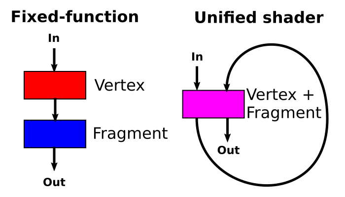
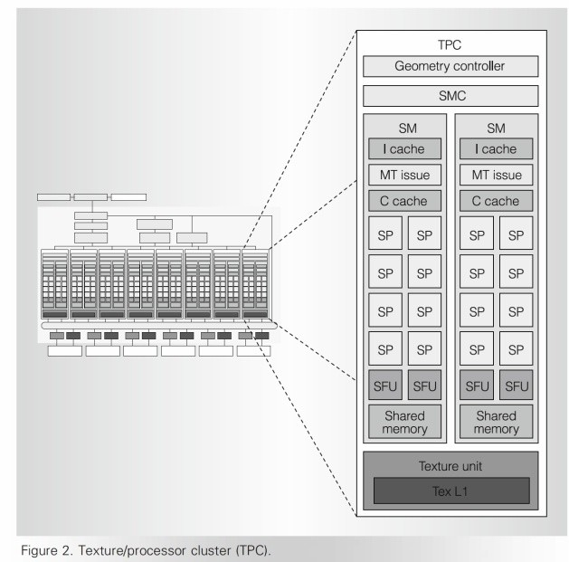
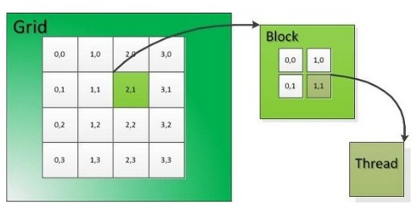
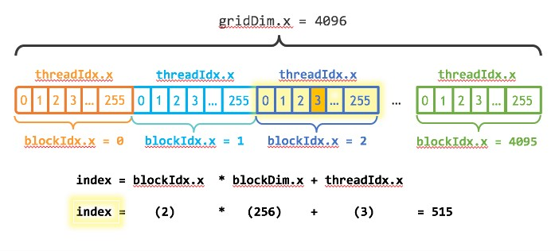

# 2 GPU와 계산 처리의 변천

**Accelerator**(가속기)는 CPU를 보완하는 보조 연산장치를 뜻한다. GPU가 과학 기술 계산에서 효율적인 모습을 보이기 시작하면서, GPU를 중심으로 하는 accelerator가 등장하기 시작했다.

---

## 2.1 vertex shader, pixel shader

3D graphics에는 **T&L**(Transpose and Lighting)이 필요했다. 초기 GPU는 Transpose(좌표 변환)을 수행하는 pipeline과, pixel의 밝기나 색을 결정하는 lighting pipeline이 독립적으로 구성됐다. transpose pipeline의 output을 lighting pipeline에 연결하면서 처리했다.

> GPU의 programmable한 rendering pipeline을 programming할 때, graphics에 특화된 function의 집합인 **shader**(셰이더)를 사용한다. (shade(그림자)에서 유래한 명칭이다.)

그러나 변환할 vertex 수가 많고 색을 계산할 pixel 수는 적은 경우라면, vertex shader(Transpose)의 병목 때문에 pixel shader(lighting)은 쉬는 pipe가 생기게 된다. 반대의 경우도 비슷한 문제가 생기게 된다.

> 참고로 한 화면의 vertex 수는 수천에서 수만 개에 이르며, pixel 수는 100만 개가 넘는다.



이런 낭비를 방지하기 위해, 여러 block을 하나로 묶는 **unified shader**(유니파이드 셰이더)라는 구조가 등장했다. unified shader는 vertex shader와 pixel shader로 사용할 계산 모듈의 수를 필요에 따라 조절할 수 있다. 

또한 unified shader의 특징에 memory를 추가하면 더 효율적으로 사용할 수 있다. vertex shader의 output을 memory에 저장하고, pixel shader가 memory에서 data를 읽는 방식으로 수행하면 pipe의 낭비 없이 계산 모듈을 사용할 수 있다.

---

## 2.2 GPGPU 

원래 GPU는 graphics processing을 위해 개발된 'OpenGL'이라는 언어로, vertex 좌표와 transpose 행렬을 곱하는 것과 같은 조작을 하는 program이 짜여져 있었다. 그래서 과학 영역에서 연산을 수행하도록 programming하는 데는 적합하지 않은 환경이었다.

이런 상황 속에서 2006년 NVIDIA는 unified shader 구조의 GPU와, SIMT 방식을 수행 가능한 **CUDA**(Compute Unified Device Architecture)라는 (C 언어를 확장한) programming 환경을 제공했다. 또한 이 GPU에는 **SM**(Streaming Multiprocessor)이라 부르는 독립된 program을 실행할 수 있는 processor 8개를 집적했다.

> OpenCL 용어로 Streaming Multiprocessor는 **CU**(Compute Unit)이라고 한다.

---

### <span style='background-color: #393E46; color: #F7F7F7'>&nbsp;&nbsp;&nbsp;🔎 살펴보기: Tesla GPU &nbsp;&nbsp;&nbsp;</span>

아래는 NVIDIA에서 출시한 Tesla GPU이다. unified shader 또는 GPGPU program을 수행하는 기본 단위인 SM은, 각 SM마다 독립적인 instruction scheduler를 사용하여 최대 768개의 thread를 parallel로 동시에 실행할 수 있다.

> [What is a Texture Processor Cluster(TPC)](https://www.geeks3d.com/20100318/tips-what-is-a-texture-processor-cluster-or-tpc/)

> [NVIDIA GPU 아키텍처 변천사](http://www.donghyun53.net/nvidia-gpu-%EC%95%84%ED%82%A4%ED%85%8D%EC%B2%98-%EB%B3%80%EC%B2%9C%EC%82%AC-%EC%83%81%ED%8E%B8/)

우선 **GPC**(GPU Processing Cluster) 속 **TPC**(Texture/Processor Cluster)의 구조를 보자.

> NVIDIA Tesla V100의 경우 6개의 GPC로 구성된다. 그리고 각 GPC는 7개의 TPC를 갖는다. 즉, GPC당 14개의 SM을 갖는다는 뜻이다.

> 여러 TPC를 묶어서 **Streaming Processor Array**로 지칭하기도 한다.

- 두 개의 SM은 하나의 TPC로 묶인다. 하지만 이는 graphic processing에서 Texture unit 연산과 SM에서의 연산 비율을 고려한 배정일 뿐이다. <U>두 SM이 동일한 program을 실행한다는 보장은 없다.</U>

- **Texture unit**은 SM에서 외부 memory로 load/store instruction을 수행 시 사용된다.

- 각 SM은 8개의 **SP**(Stream Processor)로 구성되어 있으며, Shared memory와 2개의 **SFU**(Special Function Unit)가 부착되어 있다.

- 하나의 SM은 기본적으로는 같은 instruction을 수행하는 연산 유닛이 준비되어 있다. 각각의 연산 유닛은 다음 연산을 수행하는 연산기를 가지고 있다.

  - **FMA**: Floating point Multiply Adder. 32bit single precision floating point의 multiply-accumulate(적화) 연산을 수행한다.

  > multiply-accumulate란 곱하기와 더하기를 한번에 수행하는 연산을 의미한다. $a \leftarrow a + (b \times c)$ 따라서 한 clock당 최대 두 개의 연산 수행이 가능하다.

  - **FM**: Floating point Multiply: 32bit floating point 곱셈 연산을 수행한다.




- **SP**(Stream Processor): CPU의 core격인 ALU와 비슷하게 논리, 수학 연산을 수행한다.(CUDA core라고 불리기도 한다.)

   - 정확히 말하면 SP는 여러 ALU(Arithmetic and Logical Unit)와 FPU(Floating Point Unit)을 포함한다. 따라서 scalar core라고도 한다.

   - 각각의 core가 동일한 instruction을 실행하거나, sleep한다.

   - GPU architecture에 따라 n개의 thread로 구성되어 있다.

- **SFU**(Special Function Unit): SFU는 초월함수(다항식의 근으로 정의할 수 없는 함수, 지수, 로그, 삼각함수가 대표적), pixel attribute interpolation(알려진 값을 이용해 중간에 있는 어느 값을 추정) 등의 연산에 사용한다. 4개의 floating point multiplier도 포함하고 있다.

- shared memory: SM 내에서 실행되는 thread 사이에 data 교환이 가능하게 한다. (Tesla GPU에서는 16KB이다.)

> 따라서 한 SM에서 8개의 SP와 2개의 SFU가 모두 사용될 경우, 1 clock당 최대 16(8 + 4*2)회 floating point 연산이 가능하다.

이 SM에서 여러 thread가 동시에 실행된다면, 8개의 SP와 2개의 SFU에 동일한 instruction이 broadcasting된다. 그렇게 각 unit(SP 또는 SFU)은 동일한 instruction을 수행하지만, register와 memory address는 서로 다르게 관리된다. (또한 register memory는 thread에 local하고, SM마다 서로 block되어 있다.) 이런 동작이 바로 SIMT(Single Instruction Multiple Thread) 방식의 실행이다.

---

## 2.3 CUDA

CUDA는 C 언어를 기반으로 GPU에서의 높은 병렬도를 지원하기 위한 최소한의 기능 확장을 적용한 언어다. 차이를 간단히 짚고 넘어가면 다음과 같은 것들이 있다.

<br/>

1. GPU에서 실행되는 function을 **kernel**(커널)이라고 부른다.

   - 마찬가지로 register에 kernel에서 declaration한 variable들이 저장된다.

<br/>

2. function call

   - C 언어에서는 func(a, b, c)와 같이 function 이름 뒤에 소괄호 ()로 감싼 parameter 목록을 두고 function call을 수행한다. <br/><br/>

   ```c
    // N개의 kernel 복사본을 만든다. 여기서 병렬로 실행되는 복사본이 바로 block이다.
    Kernel<<<N,1>>>();    // 1개의 thread를 갖는 block이 N개 존재한다.
    ```

   - 하지만 CUDA에서는 func\<\<\<thread 수\>\>\>(a, b, c)와 같이 thread 수를 지정해서, 이 kernel을 몇 개의 병렬로 수행할지를 지정한다.

   - 이렇게 kernel 호출에 의해 생성된 모든 thread를 grid라고 한다.

   

<br/>

3. index

   

   - 모든 thread에 같은 func 문을 실행하지만, 몇 번째 block인지를 나타내는 index(blockIdx)나 몇 번째 thread인지를 나타내는 index(threadIdx) 등이 존재한다.

   - index에 따라 읽을 variable을 설정하거나, 처리의 흐름을 변경하는 등 여러 처리에서 분산 수행이 가능하다.

> OpenCL과 많은 점이 닮았으며, 병렬 스레드 호출이나 벡터 확장 등의 기본적인 기능은 공통이다.

---

## 2.4 오류 검출과 수정

graphic processing에서는 한순간 1 pixel의 색이 잘못되어도 큰 문제가 안 되지만, 과학 기술 계산에서는 한 번의 계산 오류가 치명적인 문제를 야기할 수 있다.

오류가 발생하는 빈도는 '사용하는 GPU 수'와 '계산 시간'에 비례하므로, 여러 GPU를 사용하는 긴 계산에서 특히 오류가 발생할 가능성이 높다.

이에 따라 Fermi GPU에서는 GPU memory의 64bit data 중에서 발생한 1bit 오류를 수정할 수 있는 기능을 마련했다. 또한 GPU 칩 내부의 L2 cache, L1 cache, shared memory, register memory 등 여러 구조에도 1bit 오류 수정 기능을 추가했다.

그런데 이런 오류 수정은 64bit에 8bit 체크 bit를 붙여서 구현한 것이므로, 사실상 가용할 수 있는 memory 용량이 8/9로 줄어드는 셈이다. (따라서 사용자에 따라 오류 수정을 사용하지 않는 모드도 가능하다.)

---

## 2.5 병렬 처리 패러다임

GPU의 병렬 처리 방법에는 MIMD, SIMD, SIMT 등 다양한 방식이 있다. 들어가기 앞서 GPU 좌표 변환 계산을 parallelize하는 방법을 살필 것이다.

graphic processing에서는 좌표를 (X,Y,Z,W)로 나타냈다. 만약 4x4 transpose matrix를 곱한다면 다음과 같은 계산이 될 것이다.

$$ [X \, \, Y \, \, Z \, \, W] \times \begin{bmatrix} m00 & m01 & m02 & m03 \\ m10 & m11 & m12 & m13 \\ m20 & m21 & m22 & m23 \\ m30 & m31 & m32 & m33 \end{bmatrix} = (X' \, \, Y' \, \, Z' \, \, W') $$

이를 수식으로 다시 작성하면 다음과 같다.

$$ X' = X \times m00 + Y \times m10 + Z \times m20 + W \times m30 $$

$$ Y' = X \times m01 + Y \times m11 + Z \times m21 + W \times m31 $$

$$ Z' = X \times m02 + Y \times m12 + Z \times m22 + W \times m32 $$

$$ W' = X \times m03 + Y \times m13 + Z \times m23 + W \times m33 $$

만약 보통의 CPU라면 $X \times m00$ 을 수행하고, 여기에 multiply-accumulate를 사용하여 $Y \times m10$ 을 계산한 값을 더하는 방식으로 진행할 것이다.

---

### 2.5.1 MIMD

위 연산에서 $Y'$ 을 구하기 위해 $X'$ 를 구해야 한다는 dependency는 없다. 따라서 여러 개의 processor가 있다면, 각각 $X', Y', Z', W'$ 를 처리하면 된다.

이처럼 여러 개의 processor가 각각 independent한 program(명령 열)을 처리하는 processor를 **MIMD**(Multiple Instruction, Multiple Data)형이라고 지칭한다.

따라서 memory access 등의 공통부분에서 제약만 없다면, core의 수에 비례해서 성능이 높아질 것이다. 

> 그런데 $X' = X \times m00 + Y \times m10 + Z \times m20 + W \times m30$ 을 이대로 구하기 위해서는, 곱셈 결과를 register에 저장 뒤 다시 읽어서 더해야 한다.

---

### 2.5.2 SIMD

예제의 연산을 SIMD 방식으로 수행하면 다음과 같다. 4개의 연산기가 있으며 각각 $X', Y', Z', W'$ 값이 최종적으로 도출되게 된다.

1. $(X, Y, Z, W)$ 를 읽는다.

> 처음에는 X는 제1 연산기 register, Y는 제2 연산기 register, Z는 제3 연산기 register, W는 제4 연산기 register에 들어가게 된다.

2. X를 다른 연산기 3개에 broadcast한다.(register에 넣는다.)

3. Y를 다른 연산기 3개에 broadcast한다.

4. Z를 다른 연산기 3개에 broadcast한다.

5. W를 다른 연산기 3개에 broadcast한다.

6. 모든 연산기에서 X 값을 곱하는 연산을 수행한다.

$$ \begin{bmatrix} X' \\ Y' \\ Z' \\ W' \end{bmatrix} \leftarrow \begin{bmatrix} X \\ X \\ X \\ X \end{bmatrix} [m00 \, \, m01 \, \, m02 \, \, m03] + [0 \,\, 0 \,\, 0 \,\, 0] $$

7. 모든 연산기에 Y 값을 곱하는 연산을 수행한 뒤, 6번의 결과에 더한다.

$$ \begin{bmatrix} X' \\ Y' \\ Z' \\ W' \end{bmatrix} \leftarrow \begin{bmatrix} Y \\ Y \\ Y \\ Y \end{bmatrix} [m10 \, \, m11 \, \, m12 \, \, m13] + \begin{bmatrix} X' \\ Y' \\ Z' \\ W' \end{bmatrix} $$

8. 모든 연산기에 Z 값을 곱하는 연산을 수행한 뒤, 7번의 결과에 더한다.

$$ \begin{bmatrix} X' \\ Y' \\ Z' \\ W' \end{bmatrix} \leftarrow \begin{bmatrix} Y \\ Y \\ Y \\ Y \end{bmatrix} [m20 \, \, m21 \, \, m22 \, \, m23] + \begin{bmatrix} X' \\ Y' \\ Z' \\ W' \end{bmatrix} $$

9. 모든 연산기에 W 값을 곱하는 연산을 수행한 뒤, 8번의 결과에 더한다.

$$ \begin{bmatrix} X' \\ Y' \\ Z' \\ W' \end{bmatrix} \leftarrow \begin{bmatrix} Y \\ Y \\ Y \\ Y \end{bmatrix} [m30 \, \, m31 \, \, m32 \, \, m33] + \begin{bmatrix} X' \\ Y' \\ Z' \\ W' \end{bmatrix} $$

> broadcast하는 시간은 연산기가 sleep하게 된다.

하나의 instruction으로 여러 개의 data를 가공하므로, 이런 방식을 **SIMD**(Single Instruction, Multiple Data)라고 한다. 

연산기의 개수가 8개, 16개 등으로 많다면, 많은 vertex data를 여러 개씩 병렬로 처리하는 것으로 훨씬 더 성능을 낼 수 있다.(다만 vertex가 적다면 빈 연산기가 생기므로, 성능이 저하될 수 있다.)

하지만 이런 방식의 특성상 dependency 없이 병렬로 실행할 수 있는 data를 요구하게 된다. 또한 broadcast에 필요한 시간동안 연산기를 사용하지 못하는 낭비가 발생한다.

> data가 memory 안에 띄엄띄엄 있을 경우, 여러 번의 memory access와 교환이 필요하므로 처리가 어려워진다.

또한 과학 기술 계산에서는 data가 예시처럼 4개의 element를 갖는 vector로 한정되지 않고, 다양한 길이를 갖는 vector를 사용하게 된다. 만약 위와 같은 구조에서 5개의 element를 갖는 vector를 사용한다면, 4개와 1개로 분리해서 계산해야 하므로, 피크 연산 능력의 25%밖에 사용하지 못하는 것이 된다.

> 또한 과학 기술 계산은 중간 결과에 따라 조건 분기를 처리해야 하는 경우가 많지만, SIMD는 연산기마다 분기 방향을 바꿀 수는 없다.(mask register를 이용해서 어떤 연산기는 instruction을 무시하게끔 설정할 수는 있다.)

---

### 2.5.3 SIMT

앞서 본 SIMD가 4개의 연산기로 cycle당 1 vertex data를 처리했다면, **SIMT**(Single Instruction, Multiple Thread) 방식은 4 cycle을 이용하여 $X, Y, Z, W$ 를 처리한다.

SIMT에서 연산기 1은 오직 vertex 1의 data, 연산기 2는 오직 vertex 2, 3은 vertex 3, 4는 vertex 4의 data를 처리하게 된다. 따라서 instruction은 모든 연산기에서 동일하다.

> 이런 성질 덕분에 각 연산기의 계산이 independent하다. 마찬가지로 SIMD처럼 data 자체의 dependency에 의해 연산이 불가능한 경우가 없다.

게다가 이런 특성 때문에 조건 분기를 실현하는 것이 간단하다. 이것을 **predicate** 기능이라 하며, 예를 들면 if문의 condition을 만족(true)하는 경우 statement를 실행하고, 아닌 경우(false) 실행하지 않게끔 한다.

> thread마다 어느 정도 다른 명령 열을 수행할 수 있는 정도일 뿐, MIMD처럼 아예 다른 instruction을 수행할 수 있는 것은 아니다.

> 또한 이런 분기로 실행하지 않는 유닛도 낭비에 해당되게 된다.

하지만 SIMT 역시 과학 기술 계산에서는 흩어진 address에 access해야 하는 경우가 많으므로 문제가 생기게 된다. 한번에 어느 data에 access를 할 수 없다면, 그만큼 load/store instruction에 많은 시간이 소요되기 때문이다.

> 이를 위해 NVIDIA가 제공하는 기능 중에서는 load/store을 128byte 단위로 수행할 수 있게 해준다. 하지만 128byte 버퍼로 읽은 data 안에 필요한 data가 없다면 **replay**(다시 access하는 과정)를 거쳐야 한다.

---